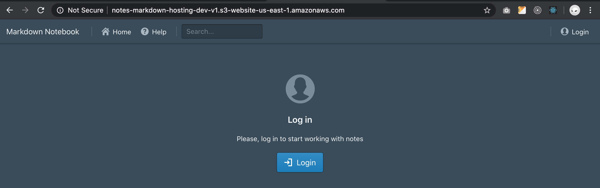
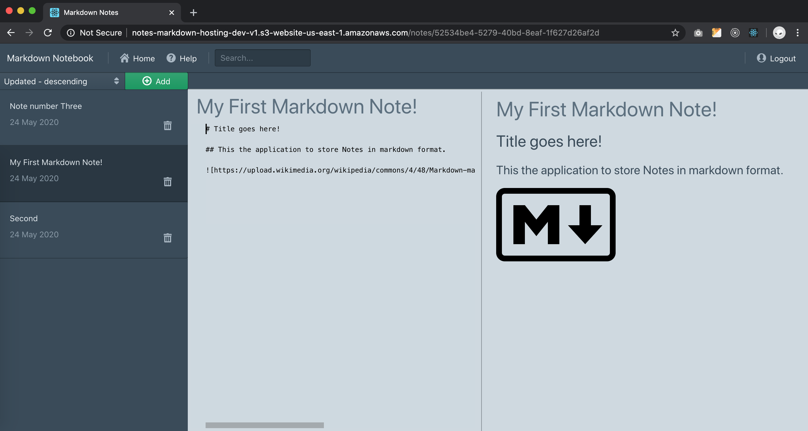

# Cloud Capstone Project – Application to create Markdown Notes

## Markdown Notes with Serverless Design

## Setup

1. To run locally please update file `frontend/src/config.ts` and uncomment url pointing to `localhost`
2. To install all packages in all applications (`backend` and `frontend`) run `make install`
3. To run serverless application locally – `make serve`
4. To run frontend application locally `make dev`

## Deployment

Test and deployment is executed automatically using `travis-ci.com` pipeline. Please refer to `.travis.yml` for details.

Manually deployment can be executed with next command:

1. `make deploy` to build and deploy serverless applicaiton.
2. `make deploy-client` to build and deploy frontend application into S3 bucket.
